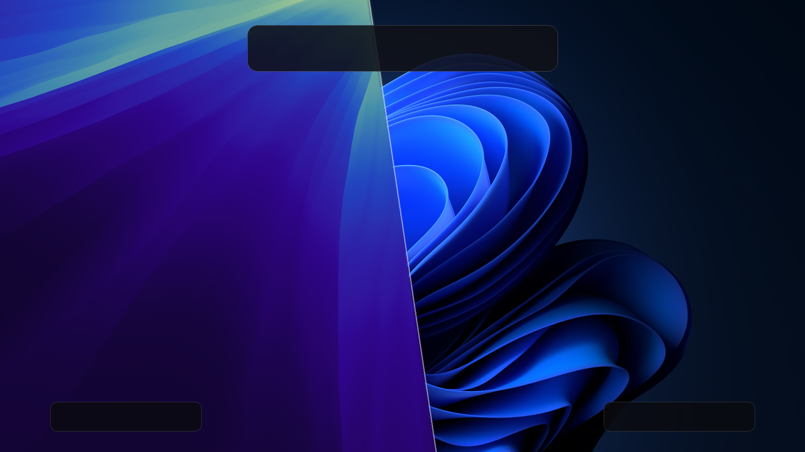

# Omarchy Undercover (v5.7.0)

[](https://github.com/MISTERNEGATIVE21/omarchy-undercover/releases/tag/v5.7.0)
[](https://github.com/MISTERNEGATIVE21/omarchy-undercover/releases)
[](https://hyprland.org)
[](https://github.com/MISTERNEGATIVE21/omarchy-undercover)
[](LICENSE)



Omarchy Undercover is a desktop transformation plugin for Omarchy Hyprland. It allows users to switch between a native macOS Sequoia interface, a Windows 11 Fluent environment, and the baseline Omarchy desktop on demand.

The suite configures status bars, docks, application launchers, window rules, compositor animations, and typography to deliver an authentic look and feel across both Quickshell (Omarchy 4.0+) and Waybar environments.

---

## Screenshots

### Apple macOS Sequoia Mode

| Dark Mode | Light Mode |
| :---: | :---: |
|  |  |

### Windows 11 Fluent Mode

| Dark Mode | Light Mode |
| :---: | :---: |
|  |  |

| Transparent Taskbar |
| :---: |
|  |

---

## Features

### Apple macOS Sequoia Mode
* Frosted glass top menu bar with Apple menu, global application menu, and Control Center.
* Hidden Bar menu bar collapse and hide/unhide items toggle button.
* Auto-sizing macOS dock with responsive scaling, magnification, and running app indicators.
* Spotlight application and file search magnifier widget.
* Mission Control window switcher.
* SF Pro typography, authentic traffic-light window controls, and spring physics animations.

### Windows 11 Fluent Mode
* Centered taskbar with Start menu, search, live weather flyout, and system tray.
* Windows 11 Start menu with pinned application grid and search integration.
* Quick Settings and Action Center flyouts with volume, brightness, Wi-Fi, and Bluetooth controls.
* Task View window switcher and Snap Assist layouts.
* Segoe UI typography, flat window styling, and cubic bezier animation curves.

### Plugin Integration & Tray Switcher
* Self-contained plugin architecture adhering to the Omarchy Plugin Manifest Schema (v1).
* Ultra-responsive 60fps animations, throttled low-latency hardware controls, and reduced memory footprint.
* Modular status bar widget with a multi-state tray icon for cycling or toggling modes.
* Non-destructive configuration management with automated baseline backup and restore.
* Seamless fallback to Waybar for legacy installations.

---

## Installation

Omarchy Undercover is packaged as an official Omarchy shell plugin.

### Install via Omarchy CLI

```bash
omarchy plugin add https://github.com/MISTERNEGATIVE21/omarchy-undercover.git --enable --yes
```

This clones the repository into `~/.config/omarchy/plugins/omarchy-undercover`, validates the manifest, links modular widgets into the shell plugin directory, and registers the global toggle keybindings.

### Enable the Bar / Tray Widget

To place the mode switcher icon in your status bar:

```bash
omarchy plugin enable omarchy-undercover --section right
```

---

## Usage

### Switching Modes via CLI

```bash
# macOS Sequoia (Dark)
omarchy-undercover -mac

# macOS Sequoia (Light)
omarchy-undercover -mac-light

# Windows 11 Fluent (Dark)
omarchy-undercover -w11

# Windows 11 Fluent (Light)
omarchy-undercover -w11-light

# Toggle between Undercover mode and baseline Omarchy desktop
omarchy-undercover --toggle

# Restore baseline Omarchy desktop configuration
omarchy-undercover --restore
```

### Mode Switcher Widget

When placed on the bar, the Undercover widget displays the active mode emblem and provides instant control:
* **Left-Click**: Opens the Undercover Control Center flyout.
* **Right-Click**: Fast-cycles between macOS, Windows 11, and baseline Omarchy.
* **Middle-Click**: Toggles between the current disguise and baseline Omarchy.
* **Scroll Wheel**: Cycles forward or backward through available modes.

---

## Keyboard Shortcuts

Undercover provides configurable, platform-authentic shortcuts for both Windows 11 and macOS Sequoia modes. All shortcuts can be customized or toggled on/off in **Settings → Shortcuts**.

> [!NOTE]
> Core Omarchy keybindings (such as <kbd>Super</kbd> + <kbd>W</kbd> for **Close Window**) are strictly protected from collisions. The Windows 11 Widgets Board uses <kbd>Super</kbd> + <kbd>Alt</kbd> + <kbd>W</kbd> by default.

### Default Global Shortcuts
| Shortcut | Action | Description |
| :--- | :--- | :--- |
| <kbd>Super</kbd> + <kbd>Alt</kbd> + <kbd>U</kbd> | Toggle Undercover Mode | Cycles between active disguise preset and default Omarchy desktop |
| <kbd>Super</kbd> + <kbd>Alt</kbd> + <kbd>B</kbd> | Toggle Auto-Hide | Enables or disables edge-sensing auto-hide daemon |

### Windows 11 Fluent Shortcuts
| Shortcut | Action | Description |
| :--- | :--- | :--- |
| <kbd>Super</kbd> (tap) / <kbd>Super</kbd> + <kbd>Space</kbd> | Start Menu | Opens Windows 11 Start Menu |
| <kbd>Super</kbd> + <kbd>E</kbd> | File Explorer | Opens File Manager in Windows 11 layout |
| <kbd>Super</kbd> + <kbd>Tab</kbd> | Task View | Opens window switcher and desktop overview |
| <kbd>Super</kbd> + <kbd>A</kbd> | Action Center | Opens Quick Settings & Action Center flyout |
| <kbd>Super</kbd> + <kbd>N</kbd> | Notifications | Opens Notification Center and Calendar |
| <kbd>Super</kbd> + <kbd>Alt</kbd> + <kbd>W</kbd> | Widgets Board | Opens live weather, news, and hardware widgets |
| <kbd>Super</kbd> + <kbd>I</kbd> | Settings | Opens Undercover Settings / Control Center |
| <kbd>Super</kbd> + <kbd>D</kbd> | Show Desktop | Minimizes or restores all visible windows |
| <kbd>Super</kbd> + <kbd>Z</kbd> | Snap Assist | Opens Windows 11 Snap Layouts menu |
| <kbd>Super</kbd> + <kbd>Shift</kbd> + <kbd>S</kbd> | Snipping Tool | Captures region screenshot to clipboard |
| <kbd>Super</kbd> + <kbd>V</kbd> | Clipboard History | Opens clipboard manager |
| <kbd>Alt</kbd> + <kbd>F4</kbd> | Close Window | Closes the active application window |
| <kbd>Super</kbd> + Arrows | Snap Assist Tiling | Snaps window to left/right halves or maximizes |

### Apple macOS Sequoia Shortcuts
| Shortcut | Action | Description |
| :--- | :--- | :--- |
| <kbd>Super</kbd> + <kbd>Space</kbd> | Spotlight Search | Opens macOS Spotlight application/file search |
| <kbd>Super</kbd> + <kbd>Tab</kbd> | Mission Control | Opens window switcher |
| <kbd>Super</kbd> + <kbd>N</kbd> | Notifications & Widgets | Opens slide-out Notification Center & Widgets |
| <kbd>Super</kbd> + <kbd>,</kbd> | System Settings | Opens macOS System Settings |
| <kbd>Super</kbd> + <kbd>E</kbd> | Finder | Opens File Manager in macOS layout |
| <kbd>Super</kbd> + <kbd>M</kbd> | Minimize | Minimizes active application window |
| <kbd>Super</kbd> + <kbd>D</kbd> | Show Desktop | Pushes windows aside to reveal desktop |
| <kbd>Super</kbd> + <kbd>Q</kbd> | Quit Window | Closes active application window |
| <kbd>Super</kbd> + <kbd>Ctrl</kbd> + <kbd>Q</kbd> | Lock Screen | Locks screen session |
| <kbd>Super</kbd> + <kbd>Ctrl</kbd> + Arrows | macOS Window Tiling | Tiles window to left/right halves or zooms window |


---

## Configuration

Configuration is stored in `~/.config/omarchy/plugins/omarchy-undercover/settings.conf`:

```ini
# Active Mode: windows | mac | omarchy
MODE=mac

# Theme variant: dark | light
THEME_VARIANT=dark

# Status bar backend: auto | quickshell | waybar
SHELL_BACKEND=auto

# macOS Dock settings
DOCK_SIZE=56
DOCK_MAX_ITEMS=24
DOCK_TRANSPARENCY=76
ENABLE_MAC_DOCK=true

# Windows 11 Taskbar settings
TASKBAR_ALIGNMENT=center
TASKBAR_TRANSPARENT=false

# Intelligent edge auto-hide
AUTOHIDE=false
```

Custom dock and taskbar pinned applications can be configured in `defaults.json` within the plugin directory.

---

## Architecture

1. **Quickshell Host Integration (Omarchy 4.0+)**:
   Status bar components are loaded natively as Quickshell `BarWidget` and `Panel` items. The main service (`Service.qml`) synchronizes Hyprland state files and dynamic layer rules on startup and upon configuration changes.
2. **Hyprland Dynamic Toggles**:
   Keybindings and window rules are deployed to `~/.local/state/omarchy/toggles/hypr/` (`undercover.lua` and `undercover.conf`). This enables hot-reloading via `hyprctl reload` without modifying the user's primary compositor configuration.
3. **IPC Interface**:
   External scripts and keyboard handlers communicate with the running shell instance over Quickshell IPC via the `omarchy-undercover` and `omarchy-undercover-service` targets.
4. **Waybar & Standalone Fallback**:
   On systems without Quickshell, the suite falls back to Waybar configurations (`configs/waybar/config-win.jsonc` and `config-mac.jsonc`), ensuring full compatibility.

---

## Requirements

* **Omarchy Linux** (v3.0+ or v4.0+ Quattro)
* **Hyprland** (Wayland compositor)
* **Quickshell** (`omarchy-shell`, standard on Omarchy 4.0+) or **Waybar**
* **Flea** (`flea`, Omarchy native file manager)
* **Rofi-Wayland** (launcher and window switcher)
* **PipeWire / WirePlumber** (`wpctl`)
* **NetworkManager** (`nmcli`) and **BlueZ** (`bluetoothctl`)

---

## Uninstallation

To remove the plugin and restore default settings:

```bash
# Disable and remove the plugin
omarchy plugin disable omarchy-undercover
omarchy plugin remove omarchy-undercover

# Restore baseline configuration
omarchy-undercover --restore
```

---

## License

GNU General Public License v3.0 or later (GPL-3.0-or-later). See [LICENSE](LICENSE) for details.
