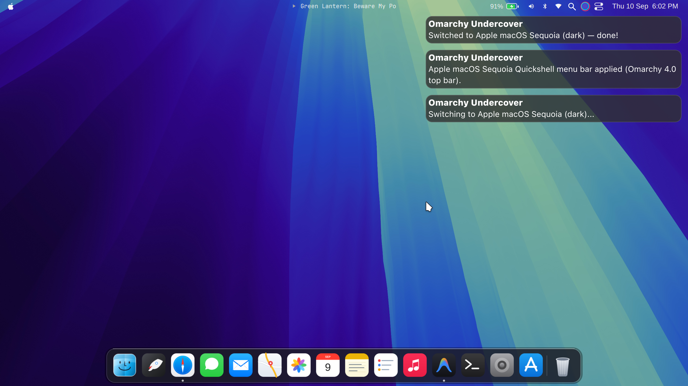
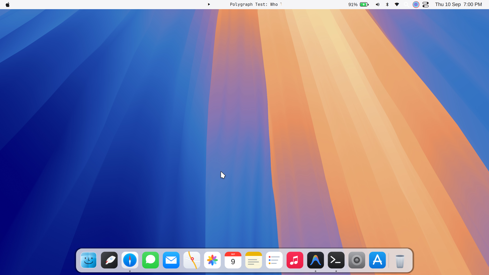
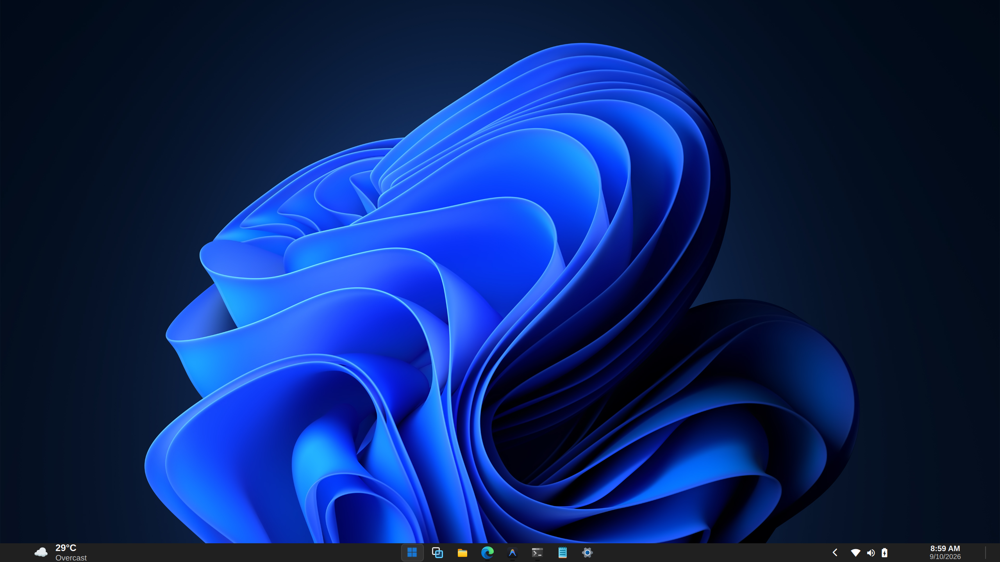
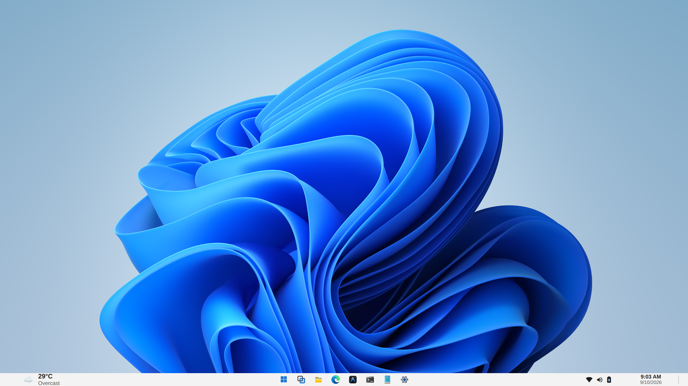
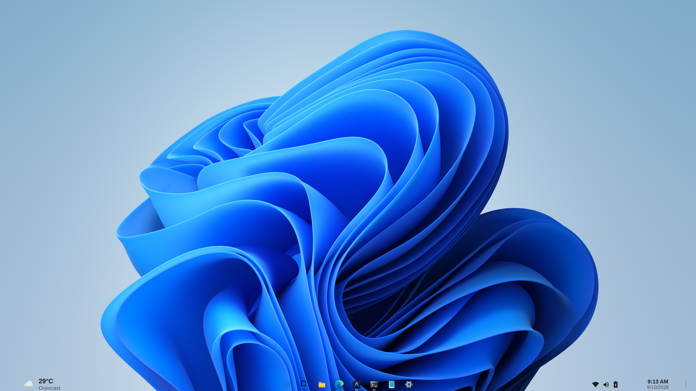

# 🕵️ Omarchy Undercover (v5.1.0)

```
  ██████╗ ███╗   ███╗ █████╗ ██████╗  ██████╗██╗  ██╗██╗   ██╗
 ██╔═══██╗████╗ ████║██╔══██╗██╔══██╗██╔════╝██║  ██║╚██╗ ██╔╝
 ██║   ██║██╔████╔██║███████║██████╔╝██║     ███████║ ╚████╔╝ 
 ██║   ██║██║╚██╔╝██║██╔══██║██╔══██╗██║     ██╔══██║  ╚██╔╝  
 ╚██████╔╝██║ ╚═╝ ██║██║  ██║██║  ██║╚██████╗██║  ██║   ██║   
  ╚═════╝ ╚═╝     ╚═╝╚═╝  ╚═╝╚═╝  ╚═╝ ╚═════╝╚═╝  ╚═╝   ╚═╝   
 ██╗   ██╗███╗   ██╗██████╗ ███████╗██████╗  ██████╗ ██████╗ ██╗   ██╗███████╗██████╗ 
 ██║   ██║████╗  ██║██╔══██╗██╔════╝██╔══██╗██╔════╝██╔═══██╗██║   ██║██╔════╝██╔══██╗
 ██║   ██║██╔██╗ ██║██║  ██║█████╗  ██████╔╝██║     ██║   ██║██║   ██║█████╗  ██████╔╝
 ██║   ██║██║╚██╗██║██║  ██║██╔══╝  ██╔══██╗██║     ██║   ██║╚██╗ ██╔╝██╔══╝  ██╔══██╗
 ╚██████╔╝██║ ╚████║██████╔╝███████╗██║  ██║╚██████╗╚██████╔╝ ╚████╔╝ ███████╗██║  ██║
  ╚═════╝ ╚═╝  ╚═══╝╚═════╝ ╚══════╝╚═╝  ╚═╝ ╚═════╝ ╚═════╝   ╚═══╝  ╚══════╝╚═╝  ╚═╝
```

[](https://github.com/MISTERNEGATIVE21/omarchy-undercover/releases/tag/v5.1.0)
[](https://hyprland.org)
[](https://github.com/MISTERNEGATIVE21/omarchy-undercover)
[](LICENSE)

> **The Ultimate Camouflage & Desktop Transformation Suite for Linux / Hyprland**  
> Effortlessly morph your Linux desktop into pixel-perfect **Apple macOS Sequoia** or **Windows 11 Fluent**, complete with authentic typography, native blur/mica glassmorphism, dynamic auto-sizing dock, live weather, functional radio dropdowns, native Flea QuickShell file manager presets, and universal GTK/Qt theming.

---

## 🚀 What's New in v5.1.0

* **📁 Native QuickShell Flea File Manager Integration**: Completely eliminated legacy GNOME Nautilus and KDE file manager dependencies in favor of **Flea** (`/usr/bin/flea`), Omarchy's official native QuickShell file manager.
* **🎭 Dynamic Disguise File Manager Presets**: Dispatched via `omarchy-undercover-filemanager` (and `omarch-undercover-filemanager`), applying customized UI/UX and keyboard profiles in real time:
  - **Apple macOS Sequoia**: Column view, comfortable density, Mac keyboard layout, and 200px sidebar width.
  - **Windows 11 Fluent**: Detailed list view, normal density, Windows keyboard layout, and 220px sidebar width.
  - **Omarchy Default**: Column view, normal density, and default keybindings.
* **🧩 100% Official Omarchy Plugin Architecture**: Fully standardized to live self-contained inside `~/.config/omarchy/plugins/undercover/` without external installer scripts, passing `omarchy plugin validate` with strict manifest schema v1 compliance.
* **⚡ Synchronized Configuration & State Engine**: Dock, taskbar, settings app, and Hyprland modules directly track and watch configurations in the official plugin directory.

---

## 🚀 What's New in v5.0.0

* **🛡️ Theme-Switching Conflict Immunity**: Neutralized layout collisions when changing or toggling Omarchy themes (`omarchy-menu toggle theme`, `omarchy theme set`, or `SUPER+SHIFT+CTRL+SPACE`). Added defensive validation guards and self-healing sanitization across all hooks.
* **🪟 Transparent Windows 11 Taskbar**: Added dynamic acrylic / transparent taskbar support with dedicated CLI switch (`--taskbar-transparent [true|false|toggle]`) and native toggles in Windows 11 Settings ▸ Personalization.
* **📶 Overhauled Wireless & Bluetooth Dashboards**: Remastered QuickShell network and Bluetooth flyouts with high-contrast Fluent styling, live signal meters, AP scanning, and direct device pairing controls.
* **🎯 Interactive Taskbar Window Switching**: Fixed Wayland `ToplevelManager` active window tracking and focus navigation — clicking open application icons reliably shifts focus and activates workspaces.
* **⏰ Spacious System Tray & Clock Margins**: Enhanced taskbar right-corner geometry with authentic Windows 11 padding, refined indicator spacing, and hover card actions.
* **📸 High-Resolution Desktop Imagery**: Updated 2560×1440 desktop and system assets for macOS Sequoia and Windows 11 Fluent transformations.

---

## 📸 Screenshots

Experience the disguise in action — pixel-perfect macOS Sequoia and Windows 11 Fluent transformations:

### 🍏 Apple macOS Sequoia

| macOS Sequoia (Dark) | macOS Sequoia (Light) |
| :---: | :---: |
|  |  |

### 🪟 Windows 11 Fluent

| Windows 11 Fluent (Dark) | Windows 11 Fluent (Light) | Windows 11 Fluent (Transparent Taskbar) |
| :---: | :---: | :---: |
|  |  |  |

Toggle between both disguises anytime with <kbd>Super</kbd> + <kbd>Alt</kbd> + <kbd>U</kbd>.

---

## 🧩 Official Omarchy Plugin Installation & Management (Omarchy 4.0+)

Omarchy Undercover follows the official Omarchy plugin specification. The plugin lives self-contained inside `~/.config/omarchy/plugins/undercover/` and is managed via standard `omarchy plugin` commands:

### Installation

Install and enable **Omarchy Undercover** directly into your running `omarchy-shell`:

```bash
omarchy plugin add https://github.com/MISTERNEGATIVE21/omarchy-undercover.git --enable --yes
```

### Enable / Place Status Bar Widget

Place the Undercover Camouflage Switcher widget onto your status bar:

```bash
omarchy plugin enable undercover --section right
```

### Validate Plugin

Verify compliance against the official Omarchy plugin manifest schema:

```bash
omarchy plugin validate ~/.config/omarchy/plugins/undercover
```

### Disable or Remove

To cleanly disable or uninstall the plugin from Omarchy shell:

```bash
# Disable plugin
omarchy plugin disable undercover

# Remove plugin
omarchy plugin remove undercover
```

---

## 🌟 Transformation Presets & Undercover Toggle

Press **`Super + Alt + U`** to instantly toggle between your active Undercover disguise and the Default Omarchy desktop:

$$\Large \text{🎭 Undercover Disguise (macOS / Windows 11)} \iff \text{🐧 Default Omarchy Desktop}$$

```
┌──────────────────────────────────────┬──────────────────────────────────────┐
│  🍏 Apple macOS Sequoia              │  🪟 Windows 11 Fluent                │
├──────────────────────────────────────┼──────────────────────────────────────┤
│  • Frosted Top Menu Bar              │  • Centered Mica Acrylic Taskbar     │
│  • Apple Menu ( About This Mac)     │  • Windows 11 Start Menu & Power Hub │
│  • Dynamic Auto-Sizing Dock          │  • Pure QuickShell Settings App      │
│  • Flea macOS Finder Column View     │  • Flea Win11 File Explorer List View│
│  • Full Vector Apple Icon Suite      │  • PowerToys Tools & Snap Assist     │
│  • 12px Traffic Lights with Glyphs   │  • Flat Fluent Window Controls       │
│  • SF Pro Text & SF Pro Display      │  • Segoe UI & Cascadia Code          │
│  • Edge-Sensing 30s Auto-Hide Dock   │  • Proportional 1:1 Taskbar Tiles    │
│  • Spotlight (Super + Space)         │  • Action Center with Live Sliders   │
│  • Mission Control (Super + Tab)     │  • Task View Window Switcher         │
│  • macOS Spring / Ease Physics       │  • Fluent Cubic Bezier Animations    │
│  • Bottom-Slide Minimize Physics     │  • Taskbar Minimize & Window Focus   │
└──────────────────────────────────────┴──────────────────────────────────────┘
```

---

## 🎛️ Dock & Taskbar Customization

The macOS dock and Windows 11 taskbar auto-scale to fit your display without icons overlapping. Tune them from **System Settings ▸ Desktop & Dock** or directly in `~/.config/omarchy/plugins/undercover/settings.conf`:

```ini
DOCK_SIZE=56          # Base icon size in px (24–128)
DOCK_MAX_ITEMS=24     # Pin the max number of icons before running-apps are capped
DOCK_TRANSPARENCY=76  # Dock background opacity in % (10–100)
```

**Custom dock apps** (`~/.config/omarchy/plugins/undercover/defaults.json`) — append your own entries and they will launch right from the dock:

```json
{
  "mac_custom_apps": [
    { "id": "myapp", "name": "My App", "icon": "myapp.svg", "exec": "myapp", "matchers": ["myapp"] }
  ]
}
```

---

## ⌨️ Global Keyboard Shortcuts

| Shortcut | Action | Description |
| :--- | :--- | :--- |
| <kbd>Super</kbd> + <kbd>Alt</kbd> + <kbd>U</kbd> | **Toggle Undercover Mode** | Toggles between active Undercover preset and Default Omarchy |
| <kbd>Super</kbd> + <kbd>B</kbd> / <kbd>Win</kbd> + <kbd>B</kbd> | **Toggle Taskbar / Dock** | Instantly hides or shows the Waybar dock/taskbar |
| <kbd>Super</kbd> + <kbd>E</kbd> / <kbd>Win</kbd> + <kbd>E</kbd> | **File Explorer / Finder** | Opens Flea File Manager with active disguise preset |
| <kbd>Super</kbd> + <kbd>Space</kbd> / <kbd>Win</kbd> | **Spotlight / Start Menu** | Opens macOS Spotlight or Windows 11 Start menu |
| <kbd>Super</kbd> + <kbd>Tab</kbd> | **Mission Control / Task View** | Opens interactive window switcher |
| <kbd>Super</kbd> + <kbd>N</kbd> | **Notification Center** | Opens macOS Widget Center or Windows 11 Action Center |
| <kbd>Super</kbd> + <kbd>D</kbd> / <kbd>Win</kbd> + <kbd>D</kbd> | **Show Desktop** | Minimizes/toggles all active windows |
| <kbd>Alt</kbd> + <kbd>F4</kbd> | **Close Window** | Closes active window (Windows mode) |

---

## 🛠️ CLI Command Reference

### Mode Switching

```bash
# 🍏 Switch to Apple macOS Sequoia (Dark mode)
omarchy-undercover -mac

# ☀️ Switch to Apple macOS Sequoia (Light mode)
omarchy-undercover -mac-light

# 🪟 Switch to Windows 11 Fluent (Dark mode)
omarchy-undercover -w11

# 🌅 Switch to Windows 11 Fluent (Light mode)
omarchy-undercover -w11-light
```

### File Manager Dispatcher

```bash
# 📁 Launch Flea File Manager with active disguise preset (Finder / Explorer)
omarchy-undercover-filemanager [path]
omarch-undercover-filemanager [path]
```

### Engine & Desktop Customization

```bash
# 🔍 Detect Omarchy version and active status bar backend
omarchy-detect-backend --json

# ⚙️ Switch or enforce shell backend preference (auto, quickshell, waybar)
omarchy-undercover --backend quickshell
omarchy-undercover --backend waybar
omarchy-undercover --backend auto

# 🚀 Toggle bar visibility across Quickshell (Omarchy 4.0+) & Waybar
omarchy-undercover-toggle-bar

# 🎛️ Toggle edge-sensing auto-hide daemon
omarchy-undercover --autohide

# 🔄 Restore original baseline configuration
omarchy-undercover --restore

# 🩺 Deep protocol integrity verification
omarchy-undercover --verify
```

---

## ⚡ Dual-Engine Architecture (Quickshell & Waybar)

Omarchy Undercover features **intelligent zero-configuration dual-engine architecture**:

1. **Omarchy 4.0+ Native (Quickshell)**:
   - On Omarchy 4.0+, the status bar and layer surfaces run on native **Quickshell** (`omarchy-shell`).
   - Windows 11 mode automatically deploys Fluent bottom taskbar layout and clock configurations to `~/.config/omarchy/shell.json`.
   - macOS Sequoia mode deploys Apple top menu bar with center-anchored clock.
   - Comprehensive Hyprland Lua layer rules (`omarchy-bar`, `omarchy-menu`, `omarchy-notifications`, `omarchy-osd`) ensure smooth compositor blur without graphical tearing or flickering.

2. **Legacy Omarchy & Standalone Waybar**:
   - For Omarchy < 4.0 or custom setups, all Waybar configurations (`configs/waybar/*`), Rofi themes, and Mako configs are preserved intact.
   - Seamlessly falls back to Waybar if Quickshell is not available.
   - You can explicitly force the engine using `omarchy-undercover --backend <quickshell|waybar|auto>`.

---

## 🛠️ GUI Control Center

```bash
# Launch GTK4 / Libadwaita Undercover Settings App (with 5-second evaporating splash)
omarchy-undercover-settings

# Launch direct settings (bypassing splash screen)
omarchy-undercover-settings -s
```

---

## 🖼️ Included 6K & 4K Wallpapers Library
 
 Stored in `assets/wallpapers/`:
- `macOS-Sequoia-Dark.jpg` & `macOS-Sequoia-Light.jpg` (Official 6K Solar Noon/Midnight)
- `Sonoma-dark.jpg` & `Sonoma-light.jpg` (Official 4K Sonoma Ribbons)
- `Ventura-dark.jpg` & `Ventura-light.jpg` (Official 4K Ventura Flower)
- `Monterey-dark.jpg` & `Monterey-light.jpg` (Official 5K Monterey Waves)
- `win11_bloom_dark.jpg` & `win11_bloom_light.jpg` (Official 4K Windows 11 Bloom)
- `win11_flow_dark.jpg` (Official 4K Flow Dark)
- `ios18_dark.jpg` & `ios18_light.jpg` (Official 4K iOS 18 Beams)

---

## 📦 External Dependencies

Omarchy Undercover integrates with standard Linux and Omarchy system components:
- **Hyprland**: Dynamic Wayland compositor (window tiling, physics & spring animations)
- **Omarchy Shell / Quickshell**: Layer shell status bar and widgets engine (v4.0+)
- **Flea**: Omarchy's native QuickShell file manager (`flea`)
- **Rofi (Wayland)**: Keyboard application launcher and Mission Control / Task View window switcher
- **WirePlumber (`wpctl`)**: Native PipeWire audio sink volume control
- **brightnessctl**: Hardware display backlight controller
- **NetworkManager (`nmcli`)**: Wi-Fi status and connection manager
- **BlueZ (`bluetoothctl`)**: Bluetooth controller and peripheral manager

---

## 📜 License

GPL-3.0-or-later © **[misternegative21](https://github.com/MISTERNEGATIVE21)**
