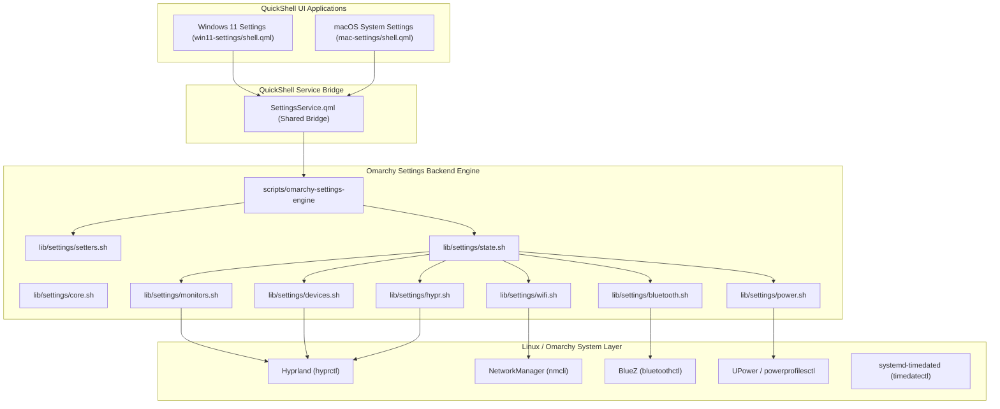

# OmaSettings Integration Specification
**Native System Settings Backend for Windows 11 and macOS Sequoia Modes**

- **Date**: 2026-10-01
- **Status**: Draft / Under Review
- **Author**: Antigravity & misternegative21
- **Target Project**: `omarchy-undercover`

---

## 1. Executive Summary & Objective

The goal of this specification is to integrate the configuration engine of [`omasettings`](https://github.com/twiking/omasettings) directly into `omarchy-undercover`, powering real, live system configuration across both **Windows 11 Fluent Settings** and **macOS Sequoia System Settings**.

Currently, several non-audio settings cards (such as Display scaling, Wi-Fi network selection, Bluetooth device pairing, Mouse speed, Power modes, and Hyprland visual effects) are mock or partially wired. By adapting `omasettings`'s proven modular library (`lib/`) and unifying it with a reactive QuickShell service (`SettingsService.qml`), both disguised Settings applications become fully functional, production-ready system configuration tools without altering or degrading their authentic visual appearance.

---

## 2. Core Constraints & Guarantees

1. **Design Invariant**:
   - In **Windows 11 Fluent Mode**, all components must strictly follow Windows 11 Fluent specifications (`Segoe UI`, Mica acrylic effects, card elevation, Windows toggles, slider handles, and Windows iconography).
   - In **macOS Sequoia Mode**, all components must strictly follow Apple macOS Sequoia specifications (`SF Pro Text`, frosted glass materials, segmented controls, Apple green switches, and macOS iconography).
2. **Safety & Non-Destructive Mutations**:
   - Like `omasettings`, configuration files must never be destructively overwritten.
   - Hyprland live overrides must be applied via `hyprctl eval` and written cleanly into managed override files (e.g., `~/.config/hypr/omasettings.conf` or `~/.config/hypr/omasettings.lua`).
   - Any manual config file touched must have a `.bak` backup preserved beforehand.
3. **High Performance**:
   - Querying the full system state must use parallel child execution (`par_run`) so the full JSON state resolves in <150ms.
4. **Self-Contained**:
   - No external plugin installation required; all necessary scripts are vendored within `omarchy-undercover` and packaged via `PKGBUILD`.

---

## 3. Architecture & Components



---

## 4. Backend Module Specifications (`lib/settings/`)

Vendored and adapted from `omasettings` under `lib/settings/`:

1. **`core.sh`**:
   - Bounded timeouts (`capture`), parallel multi-process query runner (`par_begin`, `par_run`, `par_wait`), and safe file mutation helpers.
2. **`monitors.sh`**:
   - Parses `hyprctl monitors -j`.
   - Resolves monitor descriptions, active resolutions, refresh rates, scaling factors, positions, and supported resolution/rate modes.
   - `set_monitor_scale(desc, scale)` and `set_monitor_mode(desc, mode)`.
3. **`devices.sh`**:
   - Parses `hyprctl devices -j`.
   - Extracts mouse, touchpad, and keyboard devices.
   - Supports options: `sensitivity`, `accel_profile`, `natural_scroll`, `tap-to-click`, `repeat_rate`, `repeat_delay`.
4. **`wifi.sh`**:
   - Queries `nmcli -t -f SSID,BSSID,SIGNAL,SECURITY,IN-USE device wifi list`.
   - Actions: `wifi_scan`, `wifi_connect(ssid, password)`, `wifi_disconnect`, `wifi_radio(on|off)`.
5. **`bluetooth.sh`**:
   - Communicates with `bluetoothctl`.
   - Actions: `bluetooth_power(on|off)`, `bluetooth_scan(on|off)`, `bluetooth_pair(mac)`, `bluetooth_connect(mac)`, `bluetooth_disconnect(mac)`, `bluetooth_trust(mac)`.
   - Extracts device names, icons/types, pairing state, connection status, and battery percentage.
6. **`power.sh`**:
   - Reads battery levels, status (Charging, Discharging, AC connected).
   - Manages active power profile via `powerprofilesctl` (`performance`, `balanced`, `power-saver`).
7. **`hypr.sh` & `setters.sh`**:
   - Reads and mutates:
     - `decoration:rounding`
     - `general:gaps_in`, `general:gaps_out`
     - `general:border_size`
     - `decoration:active_opacity`, `decoration:inactive_opacity`
     - `decoration:blur:enabled`
     - `animations:enabled`
   - Safely commits overrides to `~/.config/hypr/omasettings.conf`.
8. **`state.sh`**:
   - Aggregates all subsystems in parallel and returns a unified JSON document:
     ```json
     {
       "monitors": [...],
       "devices": { "mouse": [...], "touchpad": [...], "keyboard": [...] },
       "wifi": { "enabled": true, "activeSsid": "...", "networks": [...] },
       "bluetooth": { "enabled": true, "devices": [...] },
       "power": { "battery": 85, "charging": false, "activeProfile": "balanced" },
       "hypr": { "rounding": 10, "gapsIn": 6, "gapsOut": 12, "blur": true, "animations": true }
     }
     ```

---

## 5. Shared QuickShell Service (`SettingsService.qml`)

Location: [`configs/quickshell/common/SettingsService.qml`](file:///home/mister/omarchy-undercover/configs/quickshell/common/SettingsService.qml)
Symlinked into `configs/quickshell/win11-settings/` and `configs/quickshell/mac-settings/`.

### Properties
- `monitors`: Array of display objects.
- `wifiEnabled`: Boolean.
- `wifiActiveSsid`: String.
- `wifiNetworks`: Array of available Wi-Fi networks.
- `btEnabled`: Boolean.
- `btDiscovering`: Boolean.
- `btDevices`: Array of Bluetooth devices.
- `batteryPct`: Integer (0–100).
- `isCharging`: Boolean.
- `powerProfile`: String ("power-saver" | "balanced" | "performance").
- `mouseSpeed`: Real (-1.0 to 1.0 or normalized 1–20).
- `mouseNaturalScroll`: Boolean.
- `touchpadTapToClick`: Boolean.
- `touchpadNaturalScroll`: Boolean.
- `windowRounding`: Integer.
- `windowGaps`: Integer.
- `blurEnabled`: Boolean.
- `animationsEnabled`: Boolean.

### Methods
- `refresh()`: Re-triggers state query.
- `setMonitorScale(monitorName, scale)`
- `setMonitorMode(monitorName, mode)`
- `scanWifi()`
- `connectWifi(ssid, password)`
- `disconnectWifi()`
- `toggleWifi(enabled)`
- `toggleBluetooth(enabled)`
- `scanBluetooth()`
- `connectBluetooth(address)`
- `disconnectBluetooth(address)`
- `setPowerProfile(profile)`
- `setDeviceOption(deviceName, option, value, kind)`
- `setHyprOption(key, value)`

---

## 6. Windows 11 Fluent Settings Integration

### 1. System > Display
- **Visual Display Preview**: Diagram showing active displays (1, 2) with identity badges.
- **Scale & Layout**: Dropdown offering 100%, 125%, 150%, 175%, 200% scale factors applied via `setMonitorScale`.
- **Resolution**: Dropdown of supported resolutions (e.g., 2560x1440, 1920x1080) applied live.
- **Refresh Rate**: Dropdown of refresh rates (60Hz, 120Hz, 144Hz, 165Hz, etc.).
- **Night Light**: Toggle switch with color temperature warmth slider.

### 2. System > Power & Battery
- **Battery Status Card**: Visual battery bar with percentage and power plug icon.
- **Power Mode**: Dropdown selector:
  - *Best power efficiency* (`power-saver`)
  - *Balanced* (`balanced`)
  - *Best performance* (`performance`)
- **Screen & Sleep**: Inactive sleep timeout sliders.

### 3. Bluetooth & Devices
- **Devices List**: Quick tiles for connected accessories with battery percentages and "Disconnect" / "Remove" actions.
- **Add Device**: Button opening a Fluent modal drawer scanning for nearby Bluetooth devices with pair action.
- **Mouse Subpage**:
  - Primary mouse button selector (Left / Right).
  - Mouse pointer speed slider (1 to 20).
  - Scrolling direction (Standard / Natural).
- **Touchpad Subpage**:
  - Touchpad enable/disable toggle.
  - Tap to click toggle.
  - Pinch to zoom and gesture sensitivity.

### 4. Network & Internet > Wi-Fi
- **Wi-Fi Toggle**: Fluent toggle switch.
- **Available Networks**: Expandable list with signal strength icons and lock icons.
- **Inline Connect**: Clicking a network expands an inline password box with "Connect" and "Cancel" buttons.
- **Properties Card**: Shows SSID, Protocol (Wi-Fi 5 / Wi-Fi 6), IPv4 address, and security type.

### 5. Accessibility > Visual Effects
- **Transparency Effects**: Toggle switch enabling/disabling blur and window opacity.
- **Animation Effects**: Toggle switch controlling Hyprland window and workspace animations.
- **Window Corner Rounding**: Slider (0 to 24px).
- **Window Gaps**: Slider (0 to 30px).

---

## 7. macOS Sequoia System Settings Integration

### 1. Displays
- **Display Card**: Scaled preview thumbnail of the display.
- **Resolution Mode**: Segmented preview buttons (*Larger Text*, *Default*, *More Space*) and full resolution dropdown.
- **Refresh Rate**: Dropdown menu.
- **Night Shift**: Apple-style toggle and color temperature slider.

### 2. Wi-Fi
- **Wi-Fi Toggle**: Apple green toggle switch.
- **Known & Available Networks**: Grouped list with Wi-Fi signal arcs and lock badges.
- **Password Sheet**: macOS dialog sheet prompting for WPA password when connecting.

### 3. Bluetooth
- **Bluetooth Toggle**: Apple green switch.
- **My Devices / Nearby Devices**: List with device type icons (AirPods, Magic Mouse, Keyboard, Audio) and "Connect" pills.

### 4. Battery / Energy
- **Battery Status**: Battery health and percentage display.
- **Energy Mode**: Segmented selector:
  - *Low Power* (`power-saver`)
  - *Automatic* (`balanced`)
  - *High Power* (`performance`)

### 5. Trackpad & Mouse
- **Tracking Speed**: Slider from Slow to Fast.
- **Natural Scrolling**: Toggle switch.
- **Tap to Click**: Toggle switch.

### 6. Desktop & Dock / Appearance
- **Window Rounding**: Slider for corner curvature.
- **Window Gaps**: Slider for window spacing.
- **Animations**: Toggle switch for macOS window genie/fade animations.

---

## 8. Verification & Acceptance Criteria

1. **Backend Tests**:
   - `scripts/omarchy-settings-engine state` generates valid JSON in <150ms.
   - `scripts/omarchy-settings-engine wifi list` outputs network list.
   - `scripts/omarchy-settings-engine power profile <mode>` switches power profile.
   - `scripts/omarchy-settings-engine monitors scale <monitor> <scale>` applies display scale.
2. **UI Tests**:
   - `quickshell -p configs/quickshell/win11-settings` compiles with `Configuration Loaded` and 0 errors.
   - `quickshell -p configs/quickshell/mac-settings` compiles with `Configuration Loaded` and 0 errors.
   - Live adjustments to sliders and switches update system state and reflect reactively.
3. **Packaging**:
   - `PKGBUILD` installs `lib/settings/` and `scripts/omarchy-settings-engine`.
