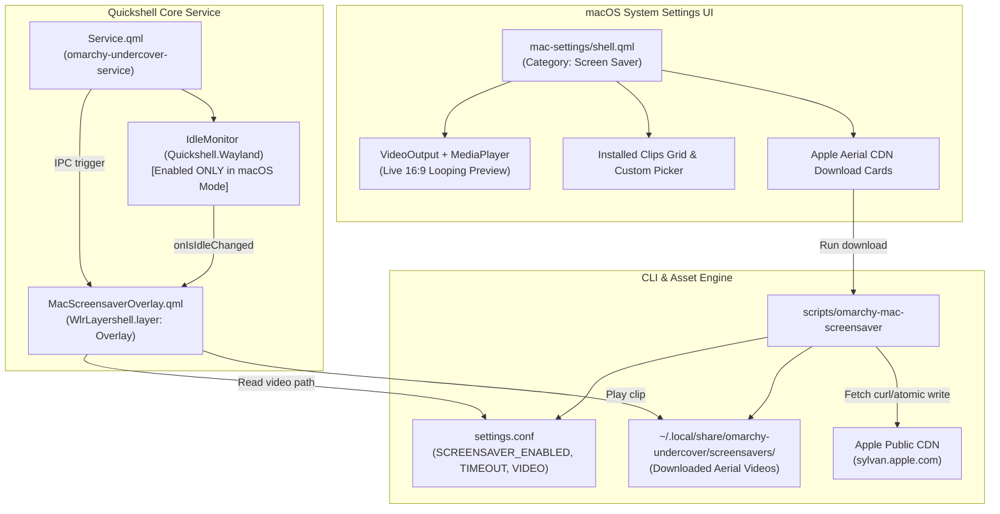

# macOS Aerial Video Screen Saver Integration Design Specification

- **Date**: 2026-10-06
- **Status**: Approved / Ready for Implementation Planning
- **Author**: Antigravity & misternegative21
- **Target Project**: `omarchy-undercover`
- **Component**: macOS Sequoia Camouflage Mode (`configs/quickshell/mac-settings/`, `Service.qml`, `scripts/omarchy-mac-screensaver`)

---

## 1. Executive Summary & Objective

The goal of this specification is to add a native, lightweight, and optimized **macOS Aerial Video Screen Saver** subsystem to `omarchy-undercover`. This feature replicates the authentic macOS Sonoma and Sequoia aerial screensaver experience directly within Omarchy's Hyprland / Quickshell environment.

### Core Goals:
1. **Strict macOS Mode Isolation**: The screensaver engine and idle watcher operate **exclusively** when `omarchy-undercover` is in macOS mode (`mac-dark` or `mac-light`). When switched to Windows 11 Fluent mode or original Omarchy baseline, the screensaver subsystem is strictly disabled, surfaces are unmapped, and media players are halted with 0% background resource consumption.
2. **Minimal & Optimized Wayland Overlay**: Leverages Quickshell's native `Quickshell.Wayland` (`WlrLayershell.layer: Overlay`) and `QtMultimedia` (`MediaPlayer` + `VideoOutput`). When inactive, the overlay window is completely unmapped and transparent.
3. **Pure Screensaver Overlay**: The screensaver plays fullscreen video over black during idle and gracefully fades out on user activity (mouse movement or keypress) back to the user's existing desktop and static wallpaper, without mutating or replacing the wallpaper.
4. **Interactive Video Preview in macOS System Settings**: Extends `configs/quickshell/mac-settings/shell.qml` with a dedicated "Screen Saver" preference section featuring a live, interactive 16:9 looping video preview box, fullscreen preview button, timeout selector, and clip carousel.
5. **Apple Aerial CDN Video Downloader**: Integrates a curated catalog of authentic Apple Aerial screensavers (1080p/4K) streamed from Apple's public CDN (`sylvan.apple.com`), allowing 1-click downloads with live status reporting.

---

## 2. Architecture & Components



---

## 3. Detailed Component Specifications

### 3.1. Wayland Overlay Engine (`MacScreensaverOverlay.qml`)

- **Layer**: `WlrLayershell.layer: WlrLayer.Overlay`
- **Namespace**: `omarchy-mac-screensaver`
- **Keyboard Focus**: `Exclusive` when active, `None` when inactive.
- **Exclusion Mode**: `ExclusionMode.Ignore`
- **Visibility & State**:
  - `property bool mapped: false`
  - `visible: mapped`
  - Inactive: `mapped = false`, `color = "transparent"`, player stopped.
  - Active: `mapped = true`, `color = "black"`, player loops video at 1.0x rate with audio muted.
- **Fade Dynamics**:
  - Fade-in animation: 350ms Quad ease from `opacity: 0` to `opacity: 1`.
  - Fade-out animation: 220ms Quad ease from `opacity: 1` to `opacity: 0`, followed by unmapping the window after 250ms.
- **Input Dismissal**:
  - `Keys.onPressed`: Dismisses screensaver immediately.
  - `MouseArea`: Tracks mouse coordinates. Uses a 4-pixel movement threshold (`Math.abs(x - lastX) > 4 || Math.abs(y - lastY) > 4`) and initial position priming to avoid accidental dismissals on window map. Single click or drag immediately triggers dismissal.
  - Dismissal calls `owner.dismissScreensaver()`.

### 3.2. Service Integration & Mode Gating (`Service.qml`)

- **State Evaluation**:
  ```qml
  readonly property bool isMacMode: root.currentState.indexOf("mac") !== -1
  property bool screensaverEnabled: true
  property int screensaverTimeout: 300 // 5 minutes default
  property string screensaverVideo: ""
  readonly property bool screensaverEngineActive: isMacMode && screensaverEnabled
  ```
- **Idle Monitoring**:
  - Instantiates `IdleMonitor` (`Quickshell.Wayland`).
  - `enabled: root.screensaverEngineActive`
  - `timeout: root.screensaverTimeout`
  - `respectInhibitors: true` (respects media playback / browser full-screen inhibitors).
  - `onIsIdleChanged`:
    - When `isIdle === true` and `screensaverEngineActive`: activates `MacScreensaverOverlay`.
    - When `isIdle === false`: dismisses `MacScreensaverOverlay`.
- **Mode Switching Cleanup**:
  - Whenever `currentState` changes away from `mac-*` (e.g., to `win11-dark`, `win11-light`, or `omarchy` baseline):
    - `screensaverEngineActive` becomes `false`.
    - `IdleMonitor.enabled = false`.
    - Any active screensaver overlay is immediately hidden and stopped.
- **IPC Extensions**:
  - Handler `omarchy-undercover-service` gains:
    - `previewScreensaver()`: Activates fullscreen screensaver immediately for manual test.
    - `dismissScreensaver()`: Immediately dismisses active screensaver overlay.
    - `reloadScreensaverConfig()`: Re-reads `settings.conf` settings.

### 3.3. macOS System Settings UI (`configs/quickshell/mac-settings/shell.qml`)

- **Category Entry**:
  - Add to sidebar items:
    ```qml
    { id: 11, iconBg: "#5856d6", icon: "display.svg", name: "Screen Saver" }
    ```
- **Category Content View**:
  1. **Hero Live Preview Box**:
     - 16:9 ratio rounded preview viewport (width: ~520px, height: ~292px) with macOS border and shadow.
     - Embeds `VideoOutput` and `MediaPlayer` looping the currently selected screensaver video.
     - Controls toolbar on hover:
       - Play / Pause button.
       - Audio mute indicator.
       - "Preview Fullscreen" pill button (calls `omarchy-undercover-service.previewScreensaver()`).
  2. **Preferences Group**:
     - "Enable Screen Saver": Apple green toggle switch (`SCREENSAVER_ENABLED`).
     - "Start after:": Segmented row or dropdown (`1 min`, `2 min`, `5 min`, `10 min`, `15 min`, `30 min`, `Never`).
  3. **Installed Clips Carousel**:
     - Grid/horizontal list of available videos found in `~/.local/share/omarchy-undercover/screensavers/` and fallback assets.
     - Thumbnail card with title, duration/size, and active selection indicator.
     - Clicking a card sets it as the active screensaver and updates the Hero Preview box immediately.
     - "Choose Custom Video..." button: launches a dialog or file selection command to import any local `.mp4`/`.webm` file.
  4. **Apple Aerial Downloader Card**:
     - List of curated Apple Aerial 1080p/4K videos.
     - For each clip: Title, geographic region, estimated size (~120–250MB), and action button:
       - If installed: Displays green badge `✔ Installed`.
       - If not installed: Displays blue button `Download`, showing download status and progress.

### 3.4. Backend CLI & Downloader (`scripts/omarchy-mac-screensaver`)

- **Path**: `scripts/omarchy-mac-screensaver` (executable `chmod +x`).
- **Storage Location**:
  - Primary store: `~/.local/share/omarchy-undercover/screensavers/`
  - Fallback/default placeholder directory: `assets/screensavers/`
- **Supported Commands**:
  - `--status`: Returns JSON status object including enabled flag, timeout, current clip path, installed clip list, and download catalog.
  - `--set <clip_id_or_path>`: Updates `SCREENSAVER_VIDEO` in `settings.conf` and signals Quickshell.
  - `--timeout <seconds>`: Updates `SCREENSAVER_TIMEOUT` in `settings.conf`.
  - `--toggle <on|off>`: Updates `SCREENSAVER_ENABLED` in `settings.conf`.
  - `--preview`: Triggers manual fullscreen test via IPC `omarchy-undercover-service`.
  - `--dismiss`: Dismisses fullscreen test via IPC.
  - `--list`: Prints available and downloadable clips.
  - `--download <clip_id>`: Downloads target clip from Apple CDN using `curl` with atomic temp file renaming and size verification.

### 3.5. Curated Apple Aerial CDN Manifest

The catalog uses public, high-speed Apple CDN endpoints (H.264 / 1080p SDR for optimal decoding performance and battery efficiency):
1. **Sonoma Horizon** (`sonoma_horizon`):
   - URL: `https://sylvan.apple.com/Videos/comp_GL_G004_C010_v03_6Mbps.mp4`
   - Description: Rolling hills and warm horizon landscape at dusk.
2. **Yosemite Valley** (`yosemite`):
   - URL: `https://sylvan.apple.com/Videos/comp_C002_C005_0818SC_001_v01_SDR_PS_20180925_sdr_2K_AVC.mp4`
   - Description: Sierra Nevada peaks and mist rolling over Yosemite Valley.
3. **Patagonia Glaciers** (`patagonia`):
   - URL: `https://sylvan.apple.com/Videos/comp_GL_G008_C007_v03_6Mbps.mp4`
   - Description: Azure alpine lakes and rugged mountain ranges.
4. **Greenland Icebergs** (`greenland`):
   - URL: `https://sylvan.apple.com/Videos/comp_GL_G002_C002_v03_6Mbps.mp4`
   - Description: Drifting icebergs in the polar ocean.
5. **Grand Canyon Dawn** (`grand_canyon`):
   - URL: `https://sylvan.apple.com/Videos/comp_C007_C004_0824AJ_001_v01_SDR_PS_20180925_sdr_2K_AVC.mp4`
   - Description: Dramatic sandstone vistas and morning sunlight.
6. **Dubai Night Skyline** (`dubai_night`):
   - URL: `https://sylvan.apple.com/Videos/comp_DB_D011_C010_v03_6Mbps.mp4`
   - Description: Illuminated futuristic towers and highway traffic at night.

---

## 4. Error Handling & Safety Guarantees

1. **Non-Destructive Wallpaper Invariant**: The desktop wallpaper setting (`omarchy-undercover-wallpaper` or Hyprpaper/Swwp) is never altered. The screensaver is strictly an overlay surface that sits above client windows and unmaps upon dismissal.
2. **Crash & Input Safety**: If `MediaPlayer` encounters an unplayable codec or missing file, it logs an error and unmaps the overlay immediately without locking out the user or rendering a persistent black rectangle. Any keypress or mouse movement unconditionally dismisses the overlay.
3. **Download Safety**:
   - Downloads run via `curl -L --fail --max-time 300` writing to `.part` files.
   - Files are validated to ensure minimum payload size before being promoted to `.mp4`.
   - Broken or aborted downloads are automatically deleted.
4. **Performance & Memory**:
   - Inactive surfaces occupy 0 GPU render buffers and unmap from the Wayland compositor.
   - When switching modes (e.g., `-w11` or `--disable`), Quickshell terminates the overlay and disables `IdleMonitor`.

---

## 5. Verification & Testing Plan

1. **CLI Verification**:
   - `scripts/omarchy-mac-screensaver --status` returns valid JSON with all fields populated.
   - `scripts/omarchy-mac-screensaver --set <clip>` updates `settings.conf`.
   - `scripts/omarchy-mac-screensaver --download sonoma_horizon` downloads and verifies the asset.
2. **QML & Syntax Verification**:
   - Syntax validation of `MacScreensaverOverlay.qml`, updated `Service.qml`, and `configs/quickshell/mac-settings/shell.qml`.
3. **Mode Isolation Verification**:
   - In macOS mode: `IdleMonitor` is enabled; `--preview` brings up the overlay.
   - In Windows 11 mode: `IdleMonitor` is disabled; `--preview` is rejected or yields no overlay.
   - In baseline Omarchy mode: Subsystem remains deactivated.
4. **Interactive UI Verification**:
   - Launching macOS System Settings displays "Screen Saver" category.
   - The Hero Preview box plays a looping preview of the selected video.
   - Clicking a downloadable clip initiates download and marks it as installed upon completion.
