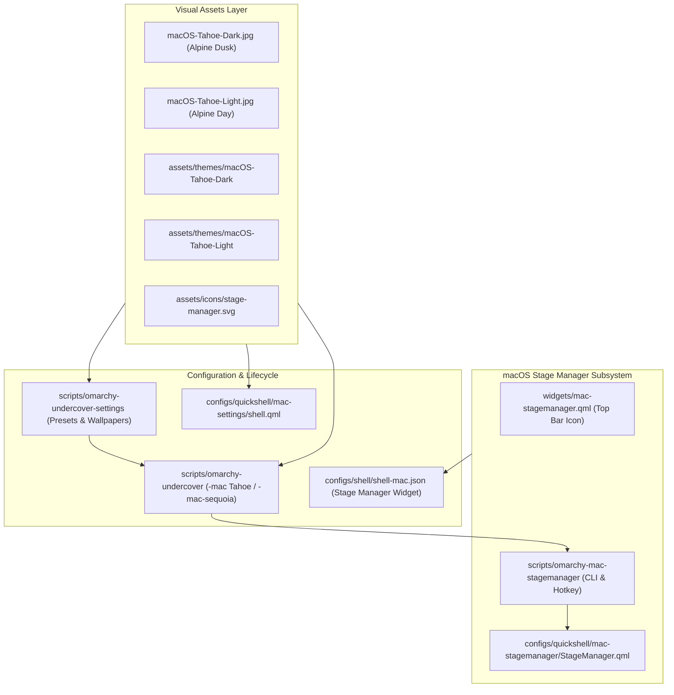

# macOS Tahoe & Stage Manager Integration Specification

- **Date**: 2026-10-06
- **Status**: Approved / Ready for Implementation Planning
- **Author**: Antigravity & misternegative21
- **Target Project**: `omarchy-undercover`
- **Release Version**: v7.0.0 (macOS Tahoe Edition)

---

## 1. Executive Summary & Objective

The goal of this specification is to upgrade `omarchy-undercover` to **v7.0.0**, introducing the flagship **Apple macOS Tahoe** (macOS 16) desktop camouflage, integrating a native **Stage Manager** live window task manager (adapted from `debba/omarchy-stage-manager`), refreshing wallpapers and GTK themes while preserving macOS Sequoia as a selectable option, and regenerating documentation and showcase previews.

### Core Objectives:
1. **Flagship Apple macOS Tahoe Transformation**:
   - Default macOS disguise set to **Apple macOS Tahoe** (Dark & Light).
   - High-resolution Lake Tahoe alpine wallpapers: `assets/wallpapers/macOS-Tahoe-Dark.jpg` and `macOS-Tahoe-Light.jpg`.
   - New clean macOS Tahoe GTK themes in `assets/themes/macOS-Tahoe-Dark/` and `assets/themes/macOS-Tahoe-Light/`.
   - Modernized Tahoe SF-style icons in `assets/icons/`.
2. **Preserve macOS Sequoia as Selectable Option**:
   - Sequoia Dark & Light preserved in Settings GUI (`omarchy-undercover-settings`), Quickshell settings (`mac-settings/shell.qml`), and CLI flags (`-mac-sequoia`, `--sequoia`).
3. **Native macOS Stage Manager Integration**:
   - Full Quickshell Stage Manager window switcher adapted from `debba/omarchy-stage-manager`.
   - Camouflaged as authentic macOS with frosted glass rail, app-grouped live Hyprland window thumbnails, and active window borders.
   - Accessible via:
     - Top bar icon widget: `widgets/mac-stagemanager.qml` in `configs/shell/shell-mac.json`.
     - Hotkey: <kbd>Super</kbd> + <kbd>Tab</kbd> / <kbd>Super</kbd> + <kbd>`</kbd> via `scripts/omarchy-mac-stagemanager`.
     - Control Center toggle.
4. **Documentation & Showcase Remake**:
   - Full rewrite of `README.md` for v7.0.0.
   - Update `scripts/generate_preview.py` and regenerate `preview.png`.

---

## 2. Architecture & Components

---

## 3. Detailed Specifications

### 3.1. Wallpapers & Visual Themes

1. **Tahoe Wallpapers**:
   - `assets/wallpapers/macOS-Tahoe-Dark.jpg`: 6K resolution alpine twilight aesthetic with Lake Tahoe deep blues, granite mountain silhouettes, and warm sunset glow.
   - `assets/wallpapers/macOS-Tahoe-Light.jpg`: 6K resolution daytime alpine panorama with crystal clear turquoise water, sunlit snow ridges, and vibrant sky.
   - Registered in `scripts/omarchy-undercover-settings`, `scripts/omarchy-undercover-wallpaper`, and `configs/quickshell/mac-settings/shell.qml`.
2. **macOS Tahoe GTK Themes (`assets/themes/`)**:
   - `assets/themes/macOS-Tahoe-Dark`:
     - Clean `gtk-3.0/gtk.css` and `gtk-4.0/gtk.css`.
     - Authentic macOS window controls: traffic lights (close: `#ff5f57`, minimize: `#febc2e`, maximize: `#28c840`), 12px rounded corner radius, dark frosted glass menus (`rgba(30, 32, 40, 0.88)`), and SF Pro styling.
   - `assets/themes/macOS-Tahoe-Light`:
     - High-vibrancy daylight frosted glass styling (`rgba(245, 245, 247, 0.90)`), subtle border elevation, and authentic macOS light window headers.
3. **Sequoia Coexistence**:
   - `macOS-Sequoia-Dark.jpg` and `macOS-Sequoia-Light.jpg` remain available in wallpaper lists.
   - Users can choose either Tahoe (default) or Sequoia from settings.

### 3.2. Stage Manager Subsystem (`debba/omarchy-stage-manager` Adapted)

1. **Top Bar Widget (`widgets/mac-stagemanager.qml`)**:
   - Added to `configs/shell/shell-mac.json` right layout section.
   - Displays authentic Stage Manager icon (`assets/icons/stage-manager.svg` or sleek vector representation).
   - Click toggles Stage Manager rail via IPC or `scripts/omarchy-mac-stagemanager --toggle`.
   - Illuminates when Stage Manager is actively revealed.
2. **Overlay Engine (`configs/quickshell/mac-stagemanager/StageManager.qml`)**:
   - Wayland Layer: `WlrLayershell.layer: Top`, unmapped when hidden.
   - Reads `Hyprland.toplevels` on the active monitor.
   - Groups open windows by application using `DesktopEntries`.
   - Card dimensions: width ~200px, 12px border radius, frosted glass backdrop (`rgba(20, 22, 28, 0.82)` with blur), and active window border highlight.
   - Clicking a card executes `hyprctl dispatch focuswindow address:<addr>` to switch to that window/stage instantly.
3. **CLI Controller & Hotkey Dispatcher (`scripts/omarchy-mac-stagemanager`)**:
   - Commands: `--toggle`, `--show`, `--hide`, `--status`.
   - Dispatches Quickshell IPC or signals Stage Manager overlay.
   - Hotkey binding: <kbd>Super</kbd> + <kbd>Tab</kbd> in macOS mode opens Stage Manager (mirroring Windows 11 Task View), and <kbd>Super</kbd> + <kbd>`</kbd> toggles the stage rail.

### 3.3. Settings & CLI Presets Updates

1. **`scripts/omarchy-undercover`**:
   - `-mac`, `--mac`, `--tahoe`: Activates **Apple macOS Tahoe (Dark)** (`macOS-Tahoe-Dark.jpg`, `macOS-Tahoe-Dark` GTK theme, Stage Manager enabled).
   - `-mac-light`, `--tahoe-light`: Activates **Apple macOS Tahoe (Light)**.
   - `-mac-sequoia`, `--sequoia`: Activates **Apple macOS Sequoia (Dark)** (`macOS-Sequoia-Dark.jpg`).
   - `-mac-sequoia-light`, `--sequoia-light`: Activates **Apple macOS Sequoia (Light)**.
   - `-w11`, `-w11-light`: Activates Windows 11 Fluent modes.
   - `--disable`, `--restore`: Restores baseline Omarchy.
2. **`scripts/omarchy-undercover-settings` (GTK4 GUI)**:
   - Presets Page displays:
     - 🏔️ **Apple macOS Tahoe (Dark - Default)**
     - ☀️ **Apple macOS Tahoe (Light)**
     - 🌲 **Apple macOS Sequoia (Dark)**
     - 🌅 **Apple macOS Sequoia (Light)**
     - 🪟 **Windows 11 Fluent (Dark & Light)**
     - 🐧 **Original Omarchy Desktop**
   - Wallpapers Page features Tahoe Dark & Light at the top of the gallery.
3. **`configs/quickshell/mac-settings/shell.qml`**:
   - Category 6 (Undercover Disguise) updated to include Tahoe Dark, Tahoe Light, Sequoia Dark, and Sequoia Light cards.
   - Category 2 (Wallpaper) updated with Tahoe wallpapers.

### 3.4. Documentation & Showcase Remake

1. **`README.md`**:
   - Bump version to **v7.0.0 (macOS Tahoe & Windows 11 Fluent)**.
   - Updated feature tables with Tahoe mode, Stage Manager, Aerial screensavers, and keyboard shortcuts.
   - Credits section updated acknowledging `debba` for Stage Manager and `nikbos` for OmaLive.
2. **`scripts/generate_preview.py` & `preview.png`**:
   - Update preview script to draw macOS Tahoe Dark with Lake Tahoe background, Stage Manager rail, and v7.0.0 badges.
   - Generate high-resolution 2560px `preview.png`.

---

## 4. Error Handling & Safety Guarantees

1. **Fallback Safety**: If Stage Manager encounters empty Hyprland toplevel lists, the stage rail hides gracefully without crashing Quickshell.
2. **Theme Non-Destructiveness**: Baseline user GTK themes (`Adwaita`, `Papirus`, `Bibata`) are preserved in baseline restore scripts.
3. **Mode Switching Cleanliness**: Switching from macOS Tahoe to Windows 11 cleanly dismisses Stage Manager, disables macOS screensavers, and transitions status bars without orphaned overlays.

---

## 5. Verification & Testing Plan

1. **Asset & Theme Integrity**:
   - Verify `macOS-Tahoe-Dark.jpg` and `macOS-Tahoe-Light.jpg` exist and are valid JPEGs.
   - Verify `macOS-Tahoe-Dark` and `macOS-Tahoe-Light` GTK themes load cleanly.
2. **CLI Testing**:
   - Verify `scripts/omarchy-undercover -mac` switches to Tahoe Dark.
   - Verify `scripts/omarchy-undercover -mac-sequoia` switches to Sequoia Dark.
   - Verify `scripts/omarchy-mac-stagemanager --status` reports status cleanly.
3. **QML Validation**:
   - Run `qmllint` on `widgets/mac-stagemanager.qml` and `configs/quickshell/mac-stagemanager/StageManager.qml`.
4. **Showcase Verification**:
   - Run `python3 scripts/generate_preview.py` and verify `preview.png` is generated at 2560px resolution.
