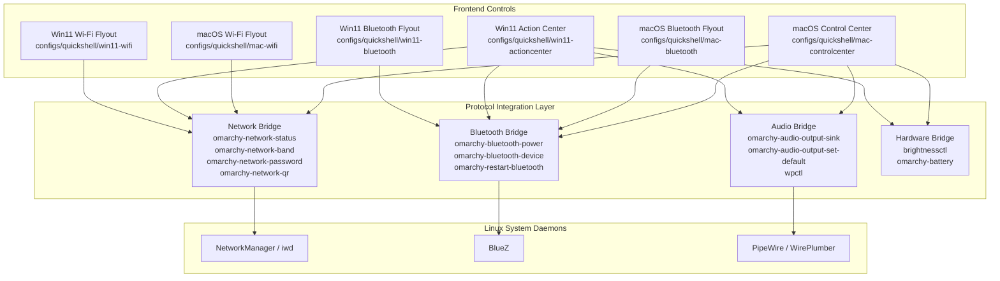

# System Protocols & Controls Refinement Design Spec

**Date:** 2026-10-08  
**Author:** Antigravity  
**Status:** Approved  
**Topic:** Borrow Omarchy's official Wi-Fi, Bluetooth, Audio, and System Protocol framework to refine control centers and flyouts across macOS and Windows 11 modes.

---

## 1. Context & Motivation

Omarchy provides a rich suite of official system utilities and plugins located in `/usr/share/omarchy/bin` and `/usr/share/omarchy/shell/plugins`:
- `omarchy-network-status --verbose`: Real-time network telemetry (interface, IP, gateway, SSID, signal in dBm, frequency band in MHz, link bitrate in MBit/s, ping to router and internet).
- `omarchy-network-band [auto|2.4|5|6]`: Wi-Fi band selection and locking.
- `omarchy-network-password`: Instant password lookup for the currently connected network.
- `omarchy-network-qr`: Wi-Fi sharing QR code generator.
- `omarchy-restart-wifi`: Graceful Wi-Fi stack reset.
- `omarchy-bluetooth-power <on|off|toggle|is-on>`: Native BlueZ adapter power controller.
- `omarchy-bluetooth-device <pair|connect|disconnect|forget> <address>`: Full device lifecycle manager.
- `omarchy-restart-bluetooth`: Bluetooth stack reset.
- `omarchy-audio-output-sink` & `omarchy-audio-output-set-default <sink>`: Audio sink router.
- `wpctl` & `brightnessctl`: Sound volume, microphone volume/mute, and display backlight controls.

`omarchy-undercover` has disguises for macOS (Control Center, top bar Wi-Fi & Bluetooth flyouts) and Windows 11 (Action Center / Quick Settings, taskbar Wi-Fi & Bluetooth flyouts). However, several controls were either relying on ad-hoc shell parsing or lacking Omarchy's advanced features (e.g. Band switching, QR sharing, password viewing, battery levels, and audio sink routing).

This overhaul binds these official system protocol capabilities into all disguise controls while retaining full aesthetic fidelity for macOS Sequoia and Windows 11 Fluent interfaces.

---

## 2. Architecture & Data Flow

---

## 3. Detailed Component Specifications

### 3.1 macOS Control Center (`configs/quickshell/mac-controlcenter/shell.qml`)
1. **Wi-Fi Module**:
   - Primary card displays active SSID, bitrate (`433.3 Mbps`), and frequency band (`5 GHz` / `2.4 GHz`).
   - Expanded sub-view provides:
     - Band pills: `Auto`, `2.4 GHz`, `5 GHz`, `6 GHz` invoking `omarchy-network-band`.
     - "Copy Password" button invoking `omarchy-network-password` with desktop notification.
     - "Share Wi-Fi (QR Code)" button invoking `omarchy-network-qr`.
     - "Restart Wi-Fi" action invoking `omarchy-restart-wifi`.
     - Filtered list of in-range Wi-Fi networks with dBm-calibrated signal icons.
2. **Bluetooth Module**:
   - Displays connected device name, category icon (🎧, ⌨️, 🖱️, 🎮, 📱), and battery percentage.
   - Expanded sub-view provides:
     - Power switch calling `omarchy-bluetooth-power`.
     - Device list with Connect / Disconnect / Forget actions calling `omarchy-bluetooth-device`.
     - "Restart Bluetooth" action invoking `omarchy-restart-bluetooth`.
3. **Sound & Display Modules**:
   - Volume slider with percentage and mute toggle.
   - Display brightness slider with percentage.
   - Now playing card with track title, artist, and playback control via `playerctl`.

### 3.2 macOS Wi-Fi & Bluetooth Menu Bar Flyouts (`configs/quickshell/mac-wifi`, `mac-bluetooth`)
1. **Wi-Fi Flyout (`configs/quickshell/mac-wifi/shell.qml`)**:
   - Native macOS Sequoia top bar dropdown.
   - Header with current network diagnostics: IP, Frequency Band, Bitrate, Router Ping.
   - Band selector row (`Auto`, `2.4G`, `5G`, `6G`).
   - Action buttons: Copy Password & Show QR Code.
2. **Bluetooth Flyout (`configs/quickshell/mac-bluetooth/shell.qml`)**:
   - Native Sequoia Bluetooth dropdown with power toggle.
   - Grouped sections: *Audio Devices*, *Input Devices*, *Other Devices*.
   - Device status with battery percentage badge and Disconnect / Forget actions.

### 3.3 Windows 11 Action Center (`configs/quickshell/win11-actioncenter/shell.qml`)
1. **Quick Settings Tiles**:
   - 6 Fluent rounded tiles: Wi-Fi, Bluetooth, Airplane Mode, Night Light, Battery Saver, Accessibility.
   - Split button pattern: tapping tile toggles power; tapping chevron opens sub-page.
   - Wi-Fi sub-page incorporates Band selector, network list, and QR/password actions.
   - Bluetooth sub-page incorporates paired device management with battery indicators.
2. **Sliders**:
   - Smooth Windows 11 volume slider with device picker.
   - Brightness slider.

### 3.4 Windows 11 Wi-Fi & Bluetooth Taskbar Flyouts (`configs/quickshell/win11-wifi`, `win11-bluetooth`)
1. **Wi-Fi Flyout (`configs/quickshell/win11-wifi/shell.qml`)**:
   - Search bar, network list, and active network properties.
   - Integrated Band selector, View Password, and Share via QR code.
2. **Bluetooth Flyout (`configs/quickshell/win11-bluetooth/shell.qml`)**:
   - Device list with battery badges, Connect/Disconnect buttons, and "Add device" discovery scan.

---

## 4. Error Handling & Non-Blocking Design

- All external executions run through Quickshell's non-blocking `Process` or detached commands to avoid any UI frame drops.
- Fallback paths: If any `omarchy-*` binary is missing or unavailable, the scripts gracefully degrade to standard `nmcli`, `bluetoothctl`, or `wpctl` commands without crashing.

---

## 5. Verification Strategy

Automated test suites:
1. `tests/test_system_protocols.sh`: Verifies Omarchy official protocol utilities (`omarchy-network-status`, `omarchy-network-band`, `omarchy-network-password`, `omarchy-bluetooth-power`, `omarchy-bluetooth-device`).
2. `tests/test_mac_controlcenter_protocols.sh`: Verifies macOS Control Center and flyouts band selection, password/QR actions, and Bluetooth controls.
3. `tests/test_win11_actioncenter_protocols.sh`: Verifies Windows 11 Action Center and flyouts protocols integration.
4. Quickshell syntax validation across all updated QML files.
